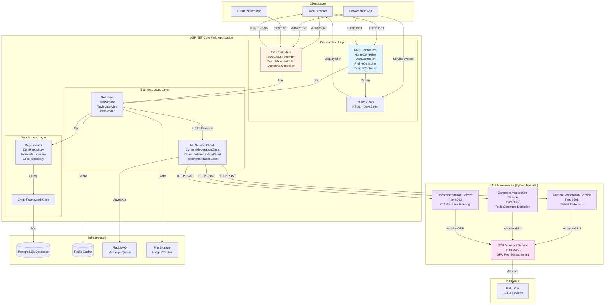
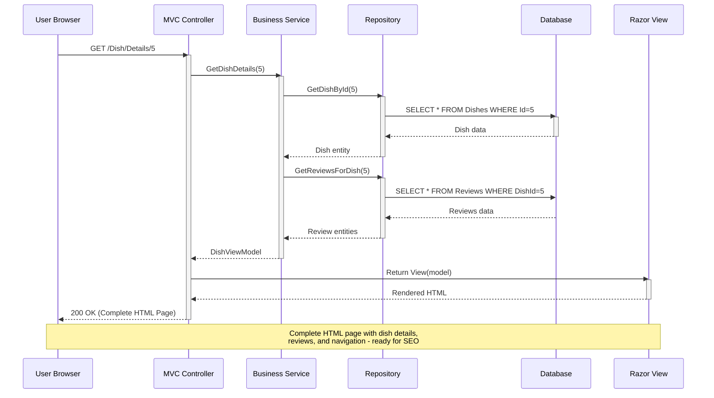
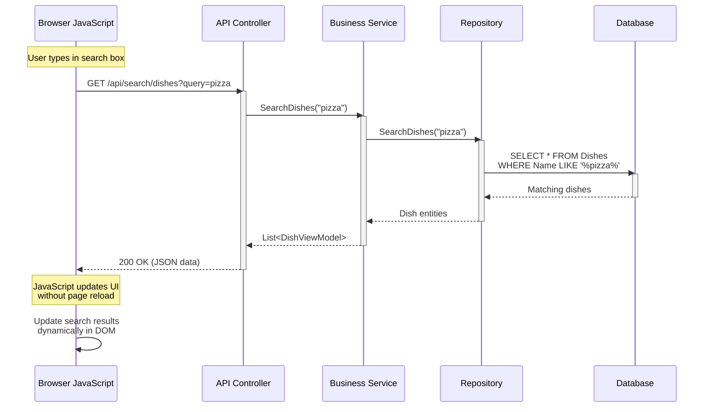
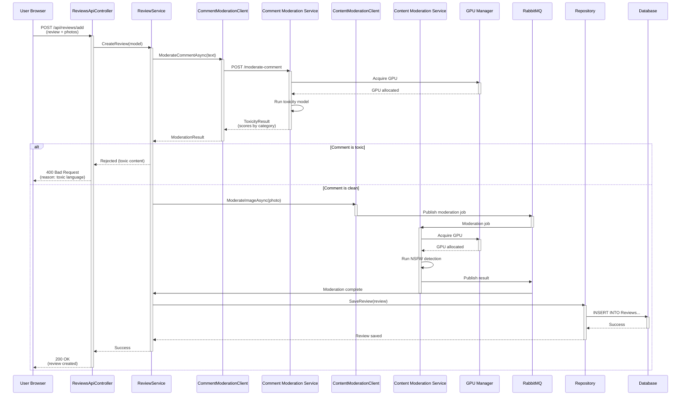
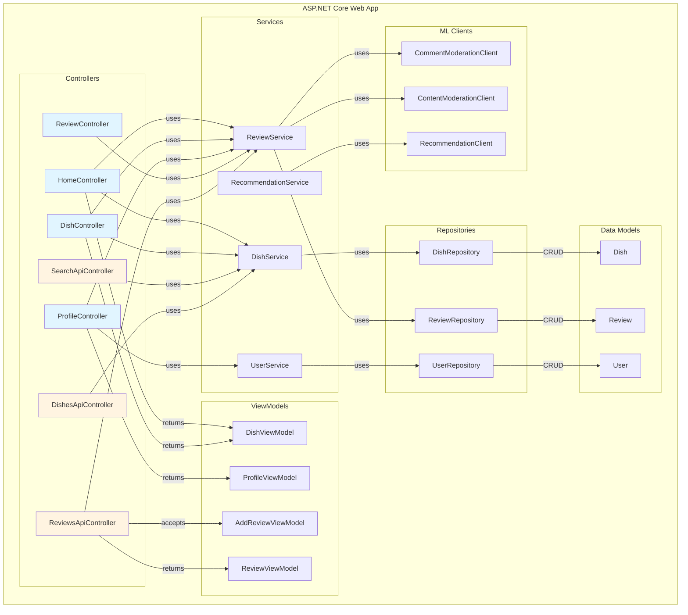
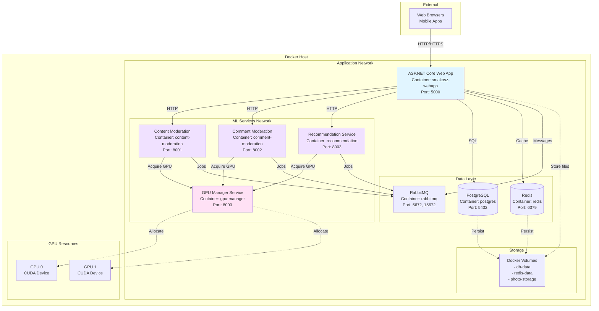
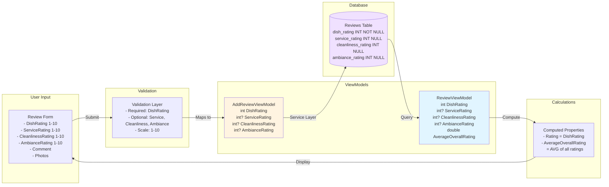
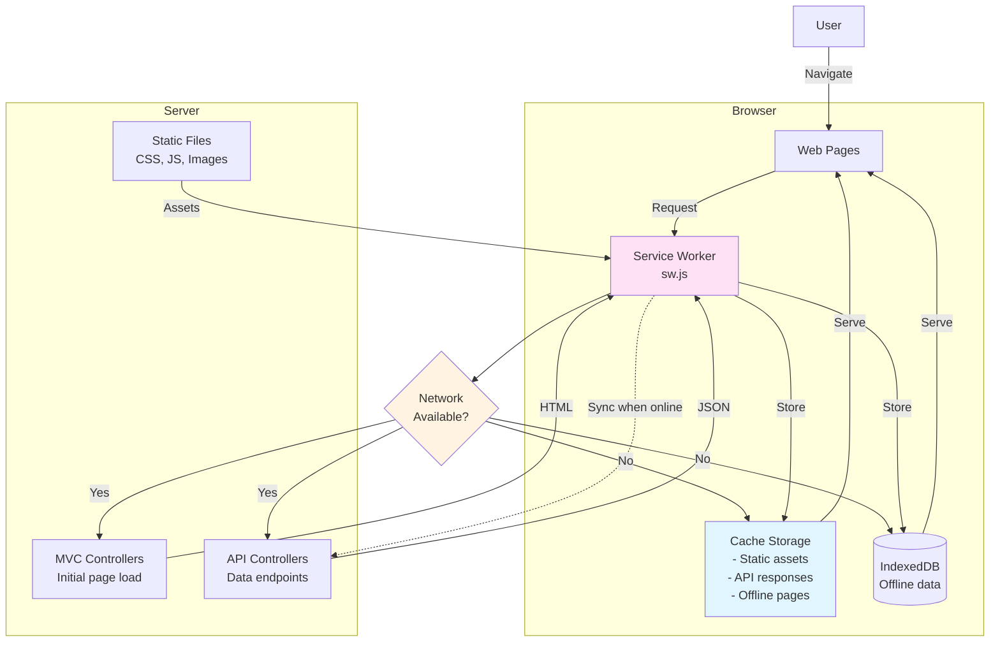

# SmakoszWebApp - Architecture Diagrams

## 1. Overall System Architecture

## 2. MVC Request Flow (Server-Side Rendering)

## 3. API Request Flow (AJAX/Dynamic Updates)

## 4. Review Submission with ML Moderation Flow

## 5. Component Diagram

## 6. Deployment Architecture (Docker Compose)

## 7. Data Flow - Multi-Dimensional Rating System

## 8. PWA Architecture

## Architecture Benefits Summary

### Hybrid MVC + API Approach

| Feature | MVC Controllers | API Controllers | Benefit |
|---------|----------------|-----------------|---------|
| **SEO** | ✅ Full HTML | ❌ No HTML | Search engines index pages |
| **Initial Load** | ✅ Fast | ⚠️ Requires JS | Users see content immediately |
| **Interactivity** | ⚠️ Page reload | ✅ Dynamic | Smooth user experience |
| **PWA Support** | ❌ Limited | ✅ Full | Offline capability, mobile install |
| **Mobile Apps** | ❌ No | ✅ Yes | Future iOS/Android apps |
| **Bandwidth** | ⚠️ Full HTML | ✅ JSON only | Efficient data transfer |
| **State Management** | ⚠️ Server-side | ✅ Client-side | Rich interactions |

### When to Use Each

**Use MVC Controllers when:**
- Initial page loads (Home, Product pages)
- SEO is critical
- Forms with complex server-side validation
- Authentication/authorization pages
- Content-heavy pages

**Use API Controllers when:**
- Search autocomplete
- Infinite scroll
- Filtering/sorting without reload
- Real-time updates
- Mobile app data
- Third-party integrations

### Microservices Benefits

1. **Separation of Concerns**: ML models isolated from web app
2. **Independent Scaling**: Scale GPU services separately
3. **Technology Flexibility**: Python for ML, C# for web
4. **Resource Management**: Centralized GPU pooling
5. **Fault Isolation**: ML service failure doesn't crash web app
6. **Independent Deployment**: Update ML models without touching web app

