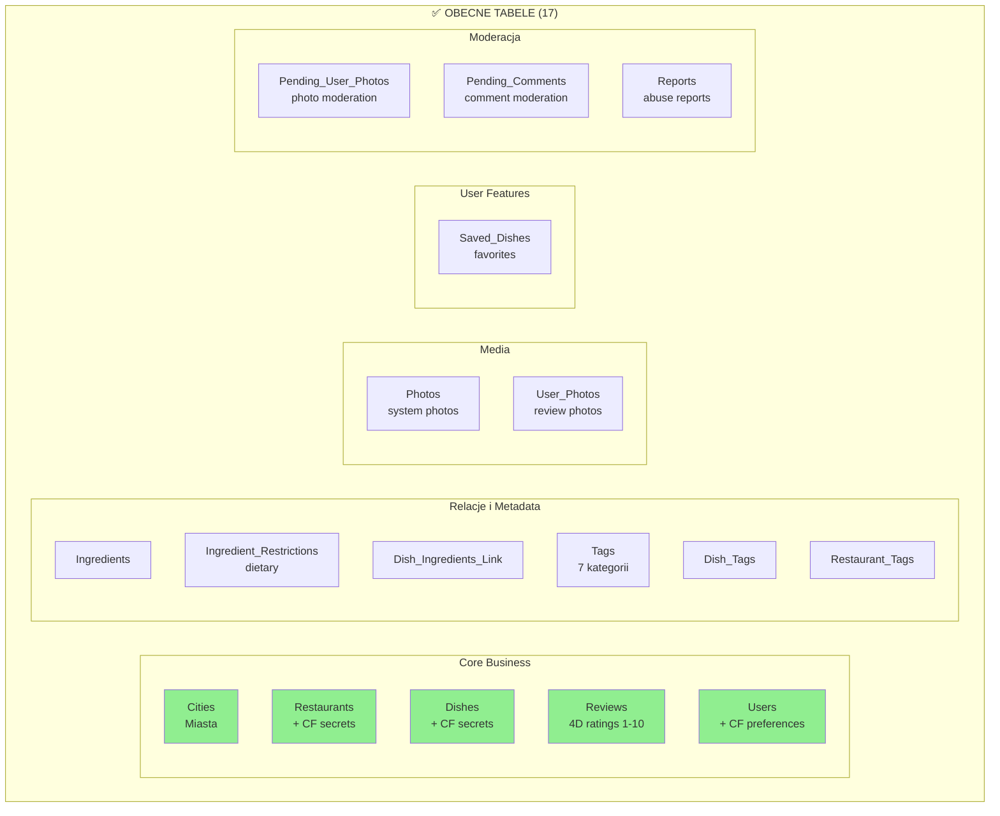
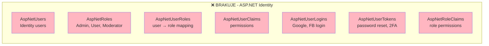

# MockDataFactory - Analiza Kompletności Bazy Danych

## Status: ⚠️ Częściowo Kompletny

**Data analizy:** 2025-11-18
**Gałąź:** `claude/debug-and-fix-errors-015hNaRJXVxrNkVRanWBABK8`

---

## 📊 Obecny Stan - 17 Tabel



---

## ❌ Brakujące Tabele

### 🔴 KRYTYCZNE (Aplikacja nie zadziała bez nich)

#### 1. ASP.NET Identity Tables (7 tabel)



**Dlaczego krytyczne:**
- Bez tego NIE BĘDZIE DZIAŁAĆ login/rejestracja
- Nie zadziała `[Authorize(Roles = "Admin")]` na kontrolerach
- ASP.NET Identity jest wymagane przez Program.cs
- Całkowicie blokuje Admin Area

**Rozwiązanie:**
```bash
dotnet ef migrations add AddIdentity
dotnet ef database update
```

---

### 🟡 WYSOKIE PRIORYTETY (Bardzo przydatne dla pełnej funkcjonalności)

#### 2. ML Moderation History

```sql
CREATE TABLE ML_Moderation_History (
    moderation_id INT PRIMARY KEY IDENTITY(1,1),
    entity_type NVARCHAR(20) NOT NULL,        -- 'review_comment', 'user_photo'
    entity_id INT NOT NULL,
    service_name NVARCHAR(50) NOT NULL,       -- 'content_moderation', 'comment_moderation'
    ml_decision NVARCHAR(20) NOT NULL,        -- 'approved', 'rejected', 'flagged'
    confidence_score FLOAT NOT NULL,          -- 0.0-1.0
    model_version NVARCHAR(50),               -- 'nsfw-v1.2', 'toxic-v2.0'
    moderated_at DATETIME DEFAULT GETDATE(),
    reviewed_by_admin BIT DEFAULT 0,
    admin_override BIT DEFAULT 0
);
```

**Dlaczego potrzebne:**
- Tracking dokładności ML models
- Audit log automatycznych decyzji
- Retraining models (false positives/negatives)
- Compliance i transparency

---

#### 3. Admin Activity Log

```sql
CREATE TABLE Admin_Activity_Log (
    log_id INT PRIMARY KEY IDENTITY(1,1),
    admin_user_id INT NOT NULL,
    action_type NVARCHAR(50) NOT NULL,        -- 'approve', 'reject', 'delete', 'edit', 'ban'
    entity_type NVARCHAR(20) NOT NULL,        -- 'review', 'user', 'dish', 'restaurant'
    entity_id INT NOT NULL,
    old_value NVARCHAR(MAX),                  -- JSON before change
    new_value NVARCHAR(MAX),                  -- JSON after change
    action_timestamp DATETIME DEFAULT GETDATE(),
    ip_address NVARCHAR(45),
    user_agent NVARCHAR(500),

    FOREIGN KEY (admin_user_id) REFERENCES Users(user_id)
);
```

**Dlaczego potrzebne:**
- Bezpieczeństwo (kto co zmienił i kiedy)
- Accountability dla adminów
- RODO compliance
- Debugging problematycznych działań
- Rollback changes

---

#### 4. Notifications

```sql
CREATE TABLE Notifications (
    notification_id INT PRIMARY KEY IDENTITY(1,1),
    user_id INT NOT NULL,
    notification_type NVARCHAR(30) NOT NULL,  -- 'review_approved', 'photo_rejected', 'admin_reply'
    title NVARCHAR(100) NOT NULL,
    message NVARCHAR(500),
    link_url NVARCHAR(500),                   -- Deep link do review/photo
    is_read BIT DEFAULT 0,
    created_at DATETIME DEFAULT GETDATE(),
    read_at DATETIME NULL,

    FOREIGN KEY (user_id) REFERENCES Users(user_id) ON DELETE CASCADE
);
```

**Dlaczego potrzebne:**
- "Twoja recenzja została zatwierdzona"
- "Zdjęcie odrzucone - wulgarny content"
- "Admin odpowiedział na twój report"
- User engagement (powroty do platformy)

---

### 🟢 ŚREDNIE PRIORYTETY (Nice to have)

#### 5. Recommendation System Cache

```sql
-- Cache preferencji CF (accelerate predictions)
CREATE TABLE User_Preferences_Cache (
    cache_id INT PRIMARY KEY IDENTITY(1,1),
    user_id INT NOT NULL,
    preferred_cuisines NVARCHAR(MAX),         -- JSON array
    preferred_price_range NVARCHAR(10),
    preferred_spice_level FLOAT,
    last_updated DATETIME DEFAULT GETDATE(),

    FOREIGN KEY (user_id) REFERENCES Users(user_id) ON DELETE CASCADE
);

-- Historia rekomendacji (tracking)
CREATE TABLE Recommendation_History (
    recommendation_id INT PRIMARY KEY IDENTITY(1,1),
    user_id INT NOT NULL,
    dish_id INT NOT NULL,
    predicted_rating FLOAT NOT NULL,          -- CF prediction
    model_version NVARCHAR(50),
    recommended_at DATETIME DEFAULT GETDATE(),
    was_clicked BIT DEFAULT 0,
    actual_rating INT NULL,                   -- If user reviewed

    FOREIGN KEY (user_id) REFERENCES Users(user_id),
    FOREIGN KEY (dish_id) REFERENCES Dishes(dish_id)
);

-- Tracking wersji modeli
CREATE TABLE ML_Model_Versions (
    model_id INT PRIMARY KEY IDENTITY(1,1),
    model_name NVARCHAR(50) NOT NULL,         -- 'cf_collaborative_filtering'
    version NVARCHAR(20) NOT NULL,
    algorithm NVARCHAR(50),                   -- 'SVD', 'NCF', 'LightGCN'
    hyperparameters NVARCHAR(MAX),            -- JSON
    training_date DATETIME,
    rmse FLOAT,
    mae FLOAT,
    is_active BIT DEFAULT 0
);
```

**Dlaczego przydatne:**
- Szybsze rekomendacje (cache, nie liczyć CF na żywo)
- A/B testing różnych modeli
- Tracking performance modeli w produkcji

---

#### 6. PWA Push Notifications

```sql
CREATE TABLE Push_Subscriptions (
    subscription_id INT PRIMARY KEY IDENTITY(1,1),
    user_id INT NOT NULL,
    endpoint NVARCHAR(500) NOT NULL,          -- Web Push endpoint
    p256dh_key NVARCHAR(200) NOT NULL,        -- Encryption key
    auth_key NVARCHAR(100) NOT NULL,          -- Auth secret
    created_at DATETIME DEFAULT GETDATE(),
    is_active BIT DEFAULT 1,

    FOREIGN KEY (user_id) REFERENCES Users(user_id) ON DELETE CASCADE
);
```

**Dlaczego przydatne:**
- Push notifications dla PWA
- "Nowa recenzja w twojej okolicy"
- "Restauracja którą obserwujesz ma nowe danie"
- Re-engagement użytkowników

---

#### 7. Social Features (Future Expansion)

```sql
-- Follow system
CREATE TABLE User_Followers (
    follower_user_id INT NOT NULL,
    followed_user_id INT NOT NULL,
    followed_at DATETIME DEFAULT GETDATE(),

    PRIMARY KEY (follower_user_id, followed_user_id),
    FOREIGN KEY (follower_user_id) REFERENCES Users(user_id) ON DELETE NO ACTION,
    FOREIGN KEY (followed_user_id) REFERENCES Users(user_id) ON DELETE NO ACTION
);

-- Lajki recenzji
CREATE TABLE Review_Likes (
    user_id INT NOT NULL,
    review_id INT NOT NULL,
    liked_at DATETIME DEFAULT GETDATE(),

    PRIMARY KEY (user_id, review_id),
    FOREIGN KEY (user_id) REFERENCES Users(user_id) ON DELETE CASCADE,
    FOREIGN KEY (review_id) REFERENCES Reviews(review_id) ON DELETE CASCADE
);

-- Komentarze do recenzji
CREATE TABLE Review_Comments (
    comment_id INT PRIMARY KEY IDENTITY(1,1),
    review_id INT NOT NULL,
    user_id INT NOT NULL,
    comment_text NVARCHAR(1000) NOT NULL,
    created_at DATETIME DEFAULT GETDATE(),
    is_approved BIT DEFAULT 1,

    FOREIGN KEY (review_id) REFERENCES Reviews(review_id) ON DELETE CASCADE,
    FOREIGN KEY (user_id) REFERENCES Users(user_id)
);
```

**Dlaczego przydatne:**
- Social aspect platformy
- Community building
- Engagement metrics
- Viral growth potential

---

#### 8. Analytics & Tracking

```sql
-- Event tracking
CREATE TABLE Analytics_Events (
    event_id BIGINT PRIMARY KEY IDENTITY(1,1),
    user_id INT NULL,                         -- NULL dla anonymous
    event_type NVARCHAR(50) NOT NULL,         -- 'page_view', 'dish_click', 'search'
    event_data NVARCHAR(MAX),                 -- JSON payload
    event_timestamp DATETIME DEFAULT GETDATE(),
    session_id NVARCHAR(100),
    ip_address NVARCHAR(45),
    user_agent NVARCHAR(500)
);

-- Session tracking
CREATE TABLE User_Sessions (
    session_id NVARCHAR(100) PRIMARY KEY,
    user_id INT NULL,
    started_at DATETIME DEFAULT GETDATE(),
    last_activity_at DATETIME DEFAULT GETDATE(),
    ended_at DATETIME NULL,
    page_views INT DEFAULT 0,
    device_type NVARCHAR(20),                 -- 'mobile', 'desktop', 'tablet'
    browser NVARCHAR(50)
);
```

**Dlaczego przydatne:**
- Metryki użytkowania
- User behavior analysis
- Conversion funnel
- Business intelligence

---

## 📋 Podsumowanie Priorytetów

| Priorytet | Tabele | Status | Action Required |
|-----------|--------|--------|-----------------|
| 🔴 **KRYTYCZNY** | ASP.NET Identity (7 tabel) | ❌ Brakuje | `dotnet ef migrations add AddIdentity` |
| 🟡 **WYSOKI** | ML_Moderation_History | ❌ Brakuje | Dodać do schema + generator |
| 🟡 **WYSOKI** | Admin_Activity_Log | ❌ Brakuje | Dodać do schema + generator |
| 🟡 **WYSOKI** | Notifications | ❌ Brakuje | Dodać do schema + generator |
| 🟢 **ŚREDNI** | Recommendation Cache (3 tabele) | ⬜ Opcjonalne | Dodać przy optymalizacji CF |
| 🟢 **ŚREDNI** | Push_Subscriptions | ⬜ Opcjonalne | Dodać przy implementacji PWA |
| 🟢 **NISKI** | Social Features (3 tabele) | ⬜ Future | Dodać przy rozszerzaniu |
| 🟢 **NISKI** | Analytics (2 tabele) | ⬜ Future | Dodać dla BI/metrics |

---

## 🎯 Rekomendowane Kroki

### Krok 1: 🔴 ASP.NET Identity (NAJPIERW!)

```bash
cd SmakoszWebApp

# Dodaj Identity do projektu
dotnet add package Microsoft.AspNetCore.Identity.EntityFrameworkCore

# Zmodyfikuj ApplicationDbContext żeby dziedziczyć po IdentityDbContext
# Uruchom migrację
dotnet ef migrations add AddIdentityTables
dotnet ef database update
```

**Czas:** ~30 minut
**Impact:** 🔥 KRYTYCZNY - bez tego aplikacja nie zadziała

---

### Krok 2: 🟡 Rozszerz Schema o 3 Tabele High-Priority

Dodaj do `MockDataFactory/schema_updated.sql`:
1. ML_Moderation_History
2. Admin_Activity_Log
3. Notifications

**Czas:** ~1-2 godziny (schema + generator)
**Impact:** Pełna funkcjonalność Admin + ML tracking

---

### Krok 3: 🟢 Opcjonalne Rozszerzenia

Dodaj gdy będzie potrzebne:
- Recommendation cache (przy optymalizacji CF)
- Push subscriptions (przy PWA)
- Social features (przy community building)
- Analytics (przy business intelligence)

**Czas:** ~3-5 godzin per feature
**Impact:** Enhanced features, nie blocking

---

## ✅ Co Jest Już Gotowe

MockDataFactory **jest w 100% kompletny** dla:
- ✅ Core business logic (restaurants, dishes, reviews)
- ✅ Collaborative Filtering (secret attributes, preferences)
- ✅ Podstawowa moderacja (Pending_*, Reports)
- ✅ System tagowania i składników
- ✅ Zdjęcia (Photos, User_Photos)
- ✅ User favorites (Saved_Dishes)
- ✅ 4-wymiarowy system ocen (1-10 scale)
- ✅ ~875,000 realistycznych recenzji
- ✅ Zoptymalizowane parametry dla CF (sparsity 99.825%)

---

## 🚀 Następne Działanie

Zdecyduj którą opcję chcesz:

**A)** Dodać ASP.NET Identity do projektu
**B)** Rozszerzyć schema o 3 tabele high-priority
**C)** Oba A + B jednocześnie
**D)** Coś innego

Zalecam: **C (Oba)** - najpierw Identity (30 min), potem rozszerzenie schema (1-2h)

