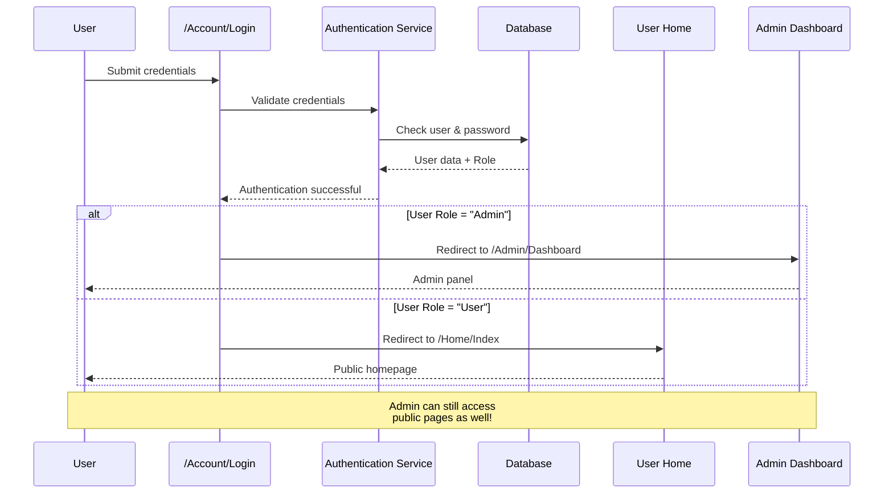

# SmakoszWebApp - Updated Structure with Admin Area

## Complete Project Structure with Admin Module (Hybrid Approach)

```mermaid
graph TB
    subgraph "Client Access Points"
        PublicUser[Public Users<br/>Browsers/PWA]
        AdminUser[Admin Users<br/>Admin Panel Access]
    end

    subgraph "ASP.NET Core Web Application"
        subgraph "Authentication Layer"
            Login[Account/Login<br/>Single Login Page]
            AuthService[Authentication Service<br/>ASP.NET Identity]
            RoleCheck{Check User Role}
        end

        subgraph "User Area - Public Controllers"
            MVC_Home[HomeController<br/>/Home/*]
            MVC_Dish[DishController<br/>/Dish/*]
            MVC_Profile[ProfileController<br/>/Profile/*]
            MVC_Review[ReviewController<br/>/Review/*]
            MVC_Search[SearchController<br/>/Search/*]
        end

        subgraph "User Area - API Controllers"
            API_Reviews[ReviewsApiController<br/>/api/reviews/*]
            API_Search[SearchApiController<br/>/api/search/*]
            API_Dishes[DishesApiController<br/>/api/dishes/*]
        end

        subgraph "Admin Area - Controllers [Authorize(Roles='Admin')]"
            Admin_Dashboard[DashboardController<br/>/Admin/Dashboard]
            Admin_Users[UsersController<br/>/Admin/Users]
            Admin_Moderation[ModerationController<br/>/Admin/Moderation]
            Admin_Dishes[DishManagementController<br/>/Admin/Dishes]
            Admin_Reviews[ReviewManagementController<br/>/Admin/Reviews]
            Admin_Reports[ReportsController<br/>/Admin/Reports]
        end

        subgraph "Admin Area - API Controllers"
            AdminAPI_Moderation[ModerationApiController<br/>/api/admin/moderation/*]
            AdminAPI_Stats[StatsApiController<br/>/api/admin/stats/*]
        end

        subgraph "Business Logic Layer - Shared Services"
            Svc_Dish[DishService]
            Svc_Review[ReviewService]
            Svc_User[UserService]
            Svc_Moderation[ModerationService]
            Svc_Reports[ReportsService]
        end

        subgraph "ML Service Clients"
            Client_Content[ContentModerationClient]
            Client_Comment[CommentModerationClient]
            Client_Rec[RecommendationClient]
        end

        subgraph "Data Access Layer"
            Repo_Dish[DishRepository]
            Repo_Review[ReviewRepository]
            Repo_User[UserRepository]
            Repo_Report[ReportRepository]
        end
    end

    subgraph "External ML Microservices"
        ML_Content[Content Moderation<br/>Port 8001]
        ML_Comment[Comment Moderation<br/>Port 8002]
        ML_Rec[Recommendation<br/>Port 8003]
        ML_GPU[GPU Manager<br/>Port 8000]
    end

    subgraph "Data Storage"
        DB[(PostgreSQL<br/>Database)]
        Redis[(Redis Cache)]
        Storage[File Storage]
    end

    %% Authentication flow
    PublicUser -->|Login| Login
    AdminUser -->|Login| Login
    Login --> AuthService
    AuthService --> RoleCheck
    RoleCheck -->|Role: User| MVC_Home
    RoleCheck -->|Role: Admin| Admin_Dashboard

    %% User MVC flow
    PublicUser --> MVC_Home
    PublicUser --> MVC_Dish
    PublicUser --> MVC_Profile
    PublicUser --> MVC_Review
    PublicUser --> MVC_Search

    %% User API flow
    PublicUser --> API_Reviews
    PublicUser --> API_Search
    PublicUser --> API_Dishes

    %% Admin flow
    AdminUser --> Admin_Dashboard
    AdminUser --> Admin_Users
    AdminUser --> Admin_Moderation
    AdminUser --> Admin_Dishes
    AdminUser --> Admin_Reviews
    AdminUser --> Admin_Reports
    AdminUser --> AdminAPI_Moderation
    AdminUser --> AdminAPI_Stats

    %% User controllers to services
    MVC_Home --> Svc_Dish
    MVC_Home --> Svc_Review
    MVC_Dish --> Svc_Dish
    MVC_Dish --> Svc_Review
    MVC_Profile --> Svc_User
    MVC_Review --> Svc_Review
    MVC_Search --> Svc_Dish
    API_Reviews --> Svc_Review
    API_Search --> Svc_Dish
    API_Dishes --> Svc_Dish

    %% Admin controllers to services (SAME SERVICES!)
    Admin_Dashboard --> Svc_Reports
    Admin_Dashboard --> Svc_User
    Admin_Users --> Svc_User
    Admin_Moderation --> Svc_Moderation
    Admin_Moderation --> Svc_Review
    Admin_Dishes --> Svc_Dish
    Admin_Reviews --> Svc_Review
    Admin_Reports --> Svc_Reports
    AdminAPI_Moderation --> Svc_Moderation
    AdminAPI_Stats --> Svc_Reports

    %% Services to ML clients
    Svc_Review --> Client_Content
    Svc_Review --> Client_Comment
    Svc_Moderation --> Client_Content
    Svc_Moderation --> Client_Comment
    Svc_Dish --> Client_Rec

    %% ML clients to services
    Client_Content --> ML_Content
    Client_Comment --> ML_Comment
    Client_Rec --> ML_Rec
    ML_Content --> ML_GPU
    ML_Comment --> ML_GPU
    ML_Rec --> ML_GPU

    %% Services to repositories
    Svc_Dish --> Repo_Dish
    Svc_Review --> Repo_Review
    Svc_User --> Repo_User
    Svc_Moderation --> Repo_Review
    Svc_Moderation --> Repo_Report
    Svc_Reports --> Repo_Report
    Svc_Reports --> Repo_Review
    Svc_Reports --> Repo_User

    %% Repositories to database
    Repo_Dish --> DB
    Repo_Review --> DB
    Repo_User --> DB
    Repo_Report --> DB

    %% Caching and storage
    Svc_Dish -.->|Cache| Redis
    Svc_Review -.->|Cache| Redis
    Svc_Review -.->|Store photos| Storage

    style Login fill:#ffd700
    style RoleCheck fill:#ffd700
    style MVC_Home fill:#e1f5ff
    style MVC_Dish fill:#e1f5ff
    style MVC_Profile fill:#e1f5ff
    style MVC_Review fill:#e1f5ff
    style API_Reviews fill:#fff4e1
    style API_Search fill:#fff4e1
    style API_Dishes fill:#fff4e1
    style Admin_Dashboard fill:#ffcccb
    style Admin_Users fill:#ffcccb
    style Admin_Moderation fill:#ffcccb
    style Admin_Dishes fill:#ffcccb
    style Admin_Reviews fill:#ffcccb
    style Admin_Reports fill:#ffcccb
    style AdminAPI_Moderation fill:#ffb6c1
    style AdminAPI_Stats fill:#ffb6c1
```



## Folder Structure

```
SmakoszWebApp/
├── Controllers/                           # User-facing MVC controllers
│   ├── HomeController.cs                 # /Home/*
│   ├── DishController.cs                 # /Dish/*
│   ├── ProfileController.cs              # /Profile/*
│   ├── ReviewController.cs               # /Review/*
│   ├── SearchController.cs               # /Search/*
│   └── AccountController.cs              # /Account/Login (shared)
│
├── Api/                                   # User-facing API controllers
│   ├── ReviewsApiController.cs           # /api/reviews/*
│   ├── SearchApiController.cs            # /api/search/*
│   └── DishesApiController.cs            # /api/dishes/*
│
├── Areas/
│   └── Admin/                            # Admin area (ASP.NET Areas)
│       ├── Controllers/                   # Admin MVC controllers
│       │   ├── DashboardController.cs    # /Admin/Dashboard
│       │   ├── UsersController.cs        # /Admin/Users
│       │   ├── ModerationController.cs   # /Admin/Moderation
│       │   ├── DishManagementController.cs # /Admin/Dishes
│       │   ├── ReviewManagementController.cs # /Admin/Reviews
│       │   └── ReportsController.cs      # /Admin/Reports
│       │
│       ├── Api/                          # Admin API controllers
│       │   ├── ModerationApiController.cs # /api/admin/moderation/*
│       │   └── StatsApiController.cs     # /api/admin/stats/*
│       │
│       └── Views/                        # Admin views
│           ├── _AdminLayout.cshtml       # Admin layout (different from user)
│           ├── Dashboard/
│           │   └── Index.cshtml
│           ├── Users/
│           │   ├── Index.cshtml
│           │   └── Edit.cshtml
│           ├── Moderation/
│           │   ├── PendingReviews.cshtml
│           │   └── FlaggedContent.cshtml
│           └── Reports/
│               └── Index.cshtml
│
├── Models/                               # ViewModels (shared)
│   ├── DishViewModel.cs
│   ├── ReviewViewModel.cs
│   ├── ProfileViewModel.cs
│   └── Admin/                            # Admin-specific ViewModels
│       ├── DashboardViewModel.cs
│       ├── ModerationQueueViewModel.cs
│       └── UserManagementViewModel.cs
│
├── Services/                             # Business logic (SHARED!)
│   ├── DishService.cs                    # Used by both user & admin
│   ├── ReviewService.cs                  # Used by both user & admin
│   ├── UserService.cs                    # Used by both user & admin
│   ├── ModerationService.cs              # Primarily for admin
│   ├── ReportsService.cs                 # Primarily for admin
│   └── ML/                               # ML service clients
│       ├── ContentModerationClient.cs
│       ├── CommentModerationClient.cs
│       └── RecommendationClient.cs
│
├── Data/
│   ├── Repositories/                     # Data access (SHARED!)
│   │   ├── DishRepository.cs
│   │   ├── ReviewRepository.cs
│   │   ├── UserRepository.cs
│   │   └── ReportRepository.cs
│   ├── SmakoszDbContext.cs
│   └── Entities/                         # Database models
│       ├── Dish.cs
│       ├── Review.cs
│       ├── User.cs
│       └── Report.cs
│
├── Views/                                # User views
│   ├── _Layout.cshtml                    # User layout
│   ├── Home/
│   ├── Dish/
│   ├── Profile/
│   └── Shared/
│
├── wwwroot/
│   ├── css/
│   │   ├── site.css                      # User styles
│   │   └── admin.css                     # Admin styles
│   ├── js/
│   │   ├── site.js                       # User scripts
│   │   └── admin.js                      # Admin scripts
│   ├── sw.js                             # Service Worker (PWA)
│   └── manifest.json                     # PWA manifest
│
└── MLServices/                           # Python microservices
    ├── GPUManagerService/
    │   ├── app.py
    │   ├── requirements.txt
    │   └── Dockerfile
    ├── ContentModerationService/
    │   ├── app.py
    │   ├── requirements.txt
    │   └── Dockerfile
    ├── CommentModerationService/
    │   ├── app.py
    │   ├── requirements.txt
    │   └── Dockerfile
    └── RecommendationService/
        ├── app.py
        ├── requirements.txt
        └── Dockerfile
```

## URL Structure

### Public/User URLs
```
https://smakosz.pl/
https://smakosz.pl/Dish/Details/5
https://smakosz.pl/Profile
https://smakosz.pl/Review/Add
https://smakosz.pl/Search?query=pizza

# API endpoints
https://smakosz.pl/api/dishes/search?query=pizza
https://smakosz.pl/api/reviews/add
https://smakosz.pl/api/search/autocomplete
```

### Admin URLs (Requires Admin Role)
```
https://smakosz.pl/Admin/Dashboard
https://smakosz.pl/Admin/Users
https://smakosz.pl/Admin/Users/Edit/123
https://smakosz.pl/Admin/Moderation/PendingReviews
https://smakosz.pl/Admin/Moderation/FlaggedContent
https://smakosz.pl/Admin/Dishes
https://smakosz.pl/Admin/Reviews
https://smakosz.pl/Admin/Reports

# Admin API endpoints
https://smakosz.pl/api/admin/moderation/approve/456
https://smakosz.pl/api/admin/stats/daily
```

## Authentication & Authorization Flow



## Security Implementation

### Admin Controllers
```csharp
namespace SmakoszWebApp.Areas.Admin.Controllers
{
    [Area("Admin")]
    [Authorize(Roles = "Admin")]  // ⚠️ Critical: Blocks non-admin users
    public class DashboardController : Controller
    {
        public IActionResult Index()
        {
            // Only accessible to Admin role
            return View();
        }
    }
}
```

### Admin API Controllers
```csharp
namespace SmakoszWebApp.Areas.Admin.Api
{
    [Area("Admin")]
    [Route("api/admin/[controller]")]
    [ApiController]
    [Authorize(Roles = "Admin")]  // ⚠️ Critical: API protection
    public class ModerationApiController : ControllerBase
    {
        [HttpPost("approve/{reviewId}")]
        public async Task<IActionResult> ApproveReview(int reviewId)
        {
            // Only admin can approve reviews
            return Ok();
        }
    }
}
```

## Program.cs Configuration

```csharp
// Configure ASP.NET Areas
builder.Services.AddControllersWithViews();

var app = builder.Build();

// Map admin area routes
app.MapControllerRoute(
    name: "admin",
    pattern: "{area:exists}/{controller=Dashboard}/{action=Index}/{id?}");

// Map default routes
app.MapControllerRoute(
    name: "default",
    pattern: "{controller=Home}/{action=Index}/{id?}");

app.Run();
```

## Key Benefits of This Structure

### 1. Single Authentication System
- One login page for everyone
- Role-based redirection after login
- Admin can still browse as a regular user

### 2. Shared Business Logic
- `DishService`, `ReviewService`, etc. used by BOTH user and admin controllers
- No code duplication
- Consistent business rules

### 3. Strong Security Separation
- `[Authorize(Roles = "Admin")]` on all admin controllers
- Admin routes protected at controller level
- Cannot access admin pages without Admin role

### 4. Clean URL Structure
- User: `/Dish/Details/5`
- Admin: `/Admin/Dishes/Edit/5`
- Clear distinction in URLs

### 5. Separate UI/UX
- User layout: `_Layout.cshtml` (public-facing design)
- Admin layout: `_AdminLayout.cshtml` (dashboard, tables, admin tools)
- Different CSS/JS bundles

### 6. Future-Proof
- Easy to add more admin features
- API endpoints for both user and admin
- PWA works for users, admin panel can be traditional MVC

## Admin Features

### Dashboard
- Total users, dishes, reviews, reports
- Recent activity feed
- Flagged content alerts
- ML moderation queue

### User Management
- View all users
- Edit user profiles
- Ban/suspend users
- View user activity history

### Content Moderation
- Review pending content (ML flagged)
- Approve/reject reviews
- Approve/reject dish photos
- View moderation history

### Dish Management
- Add/edit/delete dishes
- Manage restaurant information
- Upload dish photos
- Set availability

### Review Management
- View all reviews
- Delete inappropriate reviews
- Respond to reports
- View multi-dimensional ratings analytics

### Reports & Analytics
- User engagement metrics
- Popular dishes
- Rating trends (1-10 scale)
- ML moderation statistics
- GPU usage reports

